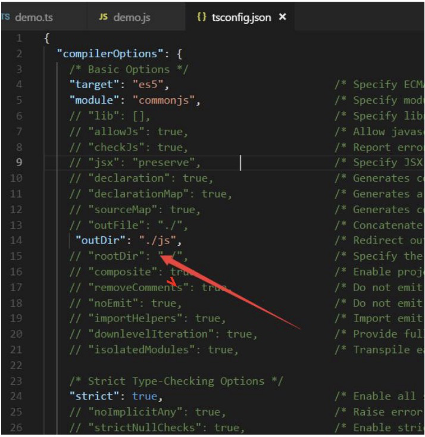
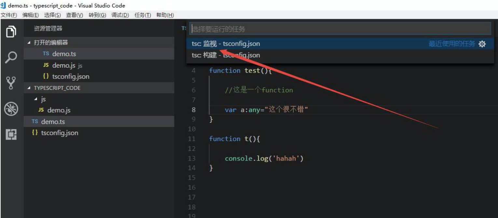
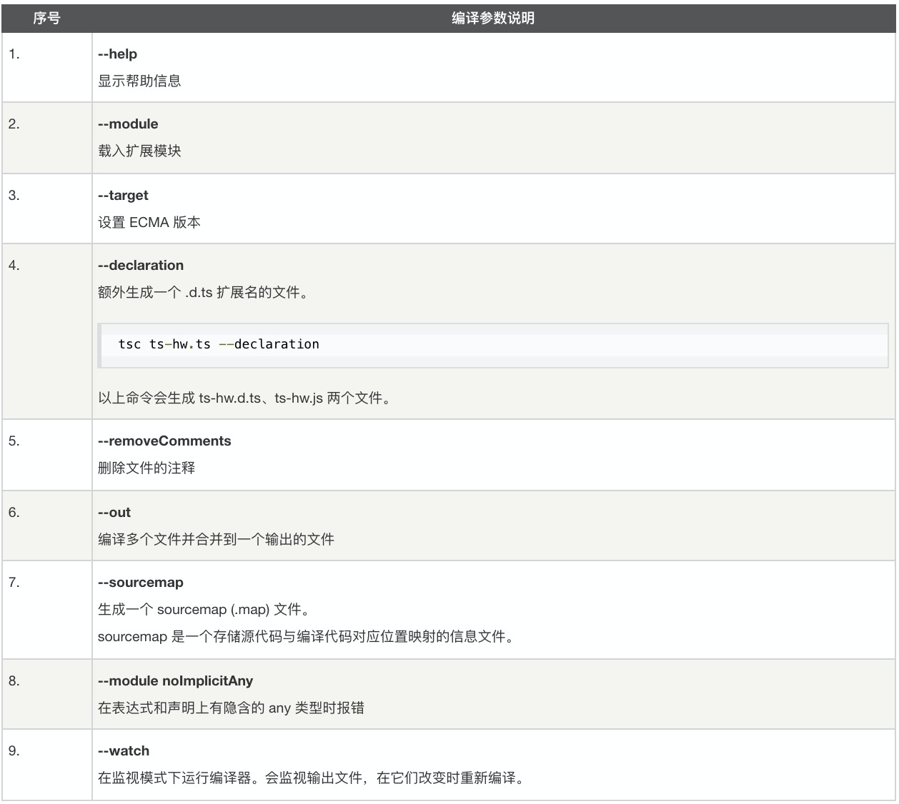
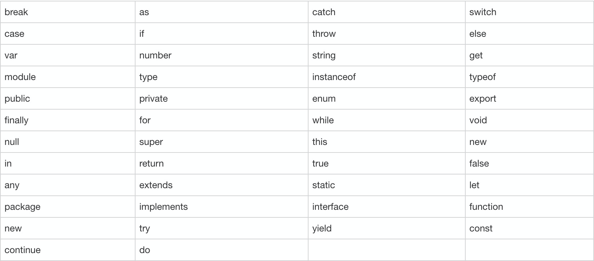

# TypeScript教程

## 一、TypeScript介绍

### 1.1. 什么是TypeScript?

> TypeScript 是 JavaScript 的一个超集，支持 ECMAScript 6 标准
>
> TypeScript 由微软开发的自由和开源的编程语言。
>
> TypeScript 设计目标是开发大型应用，它可以编译成纯 JavaScript，编译出来的 JavaScript 可以运行在任何浏览器上。

1. TypeScript 是由微软开发的一款开源的编程语言。 

2. TypeScript 是 Javascript 的超集，遵循最新的 ES6、Es5 规范。TypeScript 扩展了 JavaScript 的语法。 

3. TypeScript 更像后端 java、C#这样的面向对象语言，可以让 js 开发大型企业项目。 

4. 谷歌也在大力支持 Typescript 的推广，谷歌的 angular2.x+就是基于 Typescript 语法。 

5. 最新的 Vue 、React 也可以集成 TypeScript。 

6. Nodejs 框架 Nestjs、midway 中用的就是 TypeScript 语法。

### 1.2 TypeScript语言特性

TypeScript 是一种给 JavaScript 添加特性的语言扩展。增加的功能包括：

- 类型批注和编译时类型检查
- 类型推断
- 类型擦除
- 接口
- 枚举
- Mixin
- 泛型编程
- 名字空间
- 元组
- Await

以下功能是从 ECMA 2015 反向移植而来：

- 类
- 模块
- lambda 函数的箭头语法
- 可选参数以及默认参数

### 1.3 JavaScript 与 TypeScript 的区别

TypeScript 是 JavaScript 的超集，扩展了 JavaScript 的语法，因此现有的 JavaScript 代码可与 TypeScript 一起工作无需任何修改，TypeScript 通过类型注解提供编译时的静态类型检查.

TypeScript 可处理已有的 JavaScript 代码，并只对其中的 TypeScript 代码进行编译。


## 二、**Typescript** 安装 编译

在使用 npm 命令之前电脑必须得安装 nodejs

### 2.1 安装

```
npm install -g typescript 

或者

cnpm install -g typescript 

或者

yarn global add typescript
```

### 2.2 运行

```
tsc helloworld.ts
```

- **注意**：如果电脑上面没有安装过 cnpm，请先安装 cnpm

  ```
  npm install -g cnpm --registry=https://registry.npm.taobao.org
  ```

- **注意**：如果电脑上面没有安装过 yarn 请先安装 yarn:

  ```
  npm install -g yarn 
  
  或者
  
  cnpm install -g yarn
  ```

  

## 三、**Typescript** **开发工具** **Vscode** 自动编译.ts 文件

### 3.1 创建 tsconfig.json 文件 tsc --init 生成配置文件



### 3.2 老版本 vscode 点击: 任务->运行任务-> tsc:监视-tsconfig.json 然后就可以自动生成代码了



### 3.3 、最新版本 vscode 点击: 终端->运行任务->typescript->tsc:监视-tsconfig.json 然后就可以自动生成代码了

## 四、TypeScript 基础语法

TypeScript 程序由以下几个部分组成：

- 模块
- 函数
- 变量
- 语句和表达式
- 注释

### 4.1 第一个 TypeScript 程序

我们可以使用以下 TypeScript 程序来输出 "Hello World" ：

```
const hello : string = "Hello World!"
console.log(hello)
```

以上代码首先通过 **tsc** 命令编译：

```
tsc Runoob.ts
```

得到如下 js 代码：

```
var hello = "Hello World!";
console.log(hello);
```

最后我们使用 node 命令来执行该 js 代码。

```
$ node Runoob.js

Hello World
```

整个流程如下图所示：


我们可以同时编译多个 ts 文件：

```
tsc file1.ts file2.ts file3.ts
```

tsc 常用编译参数如下表所示：



### 4.2 TypeScript 保留关键字

TypeScript 保留关键字如下表所示：



### 4.3 空白和换行

TypeScript 会忽略程序中出现的空格、制表符和换行符。

空格、制表符通常用来缩进代码，使代码易于阅读和理解。

### 4.4 TypeScript 区分大小写

TypeScript 区分大写和小写字符

**分号是可选的**

每行指令都是一段语句，你可以使用分号或不使用， 分号在 TypeScript 中是可选的，建议使用。

以下代码都是合法的：

```
console.log("Runoob")
console.log("Google");
```

如果语句写在同一行则一定需要使用分号来分隔，否则会报错，如：

```
console.log("Runoob");console.log("Google");
```

### 4.5 TypeScript 注释

注释是一个良好的习惯，虽然很多程序员讨厌注释，但还是建议你在每段代码写上文字说明。

注释可以提高程序的可读性。

注释可以包含有关程序一些信息，如代码的作者，有关函数的说明等。

编译器会忽略注释。

**TypeScript 支持两种类型的注释**

- **单行注释 ( // )** − 在 // 后面的文字都是注释内容。
- **多行注释 (/\* \*/)** − 这种注释可以跨越多行。

```
// 这是一个单行注释
 
/* 
 这是一个多行注释 
 这是一个多行注释 
 这是一个多行注释 
*/
```

## 五、TypeScript数据类型

### 5.1 vscode配置自动编译

1. 第一步   tsc --init 生成tsconfig.json   改 "outDir": "./js",  
2. 第二步 任务 - 运行任务  监视tsconfig.json

### 5.2 typeScript中的数据类型

typescript中为了使编写的代码更规范，更有利于维护，增加了类型校验，在typescript中主要给我们提供了以下数据类型:

- 布尔类型（boolean）
- 数字类型（number）
- 字符串类型(string)
- 数组类型（array）
- 元组类型（tuple）
- 枚举类型（enum）
- 任意类型（any）
- null 和 undefined
- void类型
-  never类型


## 六、TypeScript函数

1. 函数的定义

2. 可选参数

3. 默认参数

4. 剩余参数

5. 函数重载

   > 在 TypeScript 中有函数重载的概念，但并不是定义几个同名实体函数，然后根据不同的参数个数或类型来自动调用相应的函数。TypeScript的函数重载是在类型系统层面的，是为了更好地进行类型推断。TypeScript的函数重载通过为一个函数指定多个函数类型定义，从而对函数调用的返回值进行检查

   

6. 箭头函数  es6


## 七、Typescript中的类

### 7.1  javascript中的类和静态方法 继承（原型链继承、对象冒充继承、原型链+对象冒充组合继承）

### 7.2  Typescript中的类  类的定义 继承 类里面的修饰符（上）


### 7.3  Typescript中的类  类中的静态属性 静态方法 抽象类 多态

## 问题:

1. 无法将ts编译成js

## 八、Typescript中的接口

### 8.1 接口能接口的问题

  接口可以定义对象的结构  或 函数参数为对象的结构  或者  函数的类型


### 8.2 如何定义一个接口

  interface 接口名称{
    结构
  }

### 8.3 在接口中如何定于可选属性

  在接口中如果要定义可选属性,可以使用?号来解决

### 8.4 了解什么是多余属性检查  

  在ts中,如何接口定义的接口,在传递参数的时候不存在,则会报错,这个就属于多余属性检查

### 8.5 如何避开多余属性检查

  一共有三种方式: 
   1. 类型断言
      使用as关键字
   2. 索引签名
      在接口中使用 [prop : string] : any
   3. 利用类型兼容
      将传递的对象赋值给一个变量,然后在进行传参,这个时候避开多余属性检查

### 8.6 如何使用接口定义函数类型

  interface 接口名称{
    方法类型 
    (num1:number,num2:number) : number
  }

  let add : 接口名称 = (num1, num2) =》num1 + num2

  add(1,2)

### 8.7 只读属性

  readonly , 使用readonly定义的属性,不能子啊进行修改

   

## 九、TypeScript中的装饰器

### 9.1 什么是装饰器?

```
 装饰器:装饰器是一种特殊类型的声明，它能够被附加到类声明，方法，属性或参数上，可以修改类的行为。


    通俗的讲装饰器就是一个方法，可以注入到类、方法、属性参数上来扩展类、属性、方法、参数的功能。
    

    常见的装饰器有：类装饰器、属性装饰器、方法装饰器、参数装饰器


    装饰器的写法：普通装饰器（无法传参） 、 装饰器工厂（可传参）


    装饰器是过去几年中js最大的成就之一，已是Es7的标准特性之一
```

#### 9.1.1 什么是类装饰器?

```
类装饰器：类装饰器在类声明之前被声明（紧靠着类声明）。 类装饰器应用于类构造函数，可以用来监视，修改或替换类定义。 传入一个参数
```

### 9.2 类装饰器

#### 9.2.1 普通装饰器(无法传参)

```
@函数名   //注意: 普通装饰器不用加() 但是无法传参
```

#### 9.2.2 装饰器工厂(可以传参)

```
@函数名(“参数”)   //注意: 装饰器工厂需要() 可以传参
```


### 9.3 属性装饰器

### 9.4 方法装饰器

### 9.5 装饰器的执行顺序


### 9.6 总结

1. 什么是装饰器?

   装饰器是一种特殊类型的声明,可以注入代类 、 类方法 、 类属性 、 类参数的功能 

2. 装饰器都有哪些?

   - 类装饰器

     ```
     @类函数名
     class App{}
     ```

   - 属性装饰器

     ```
     @类函数名
     class App{
     	@属性方法的函数名
     	定义的属性
     }
     ```

   - 方法装饰器

     ```
     @类函数名
     class App{
     	@属性方法的函数名
     	定义的属性
     	
     	@方法的函数名
     	定义的方法
     }
     ```

     

   - 方法参数装饰器

     ```
     @类函数名
     class App{
     	@属性方法的函数名
     	定义的属性
     	
     	@方法的函数名
     	定义的方法
     	
     	函数名(@装饰器名称 参数:参数类型)
     }
     ```

## 十、TypeScript中的模块化

## 十一、TypeScript中的命名空间

## 十二、TypeScript总结